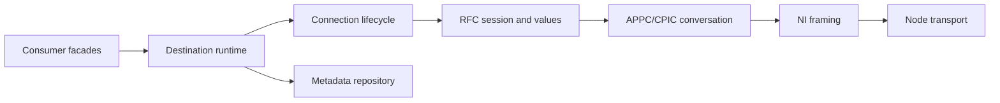

# Architecture

Why this codebase is shaped the way it is. `AGENTS.md` says which directory owns
what; this page says why those boundaries exist and what breaks when a change
crosses one.

Classic RFC is a stateful binary protocol with negotiated behaviour and no
public specification. That single fact drives almost every decision here.

## Layers

| Layer | Directory |
|---|---|
| Consumer facades | `src/compat/`, `src/client/` |
| Destination runtime | `src/destination/`, `src/pool/` |
| Connection lifecycle | `src/lifecycle/` |
| Metadata repository | `src/metadata/` |
| RFC session and values | `src/values/` |
| APPC/CPIC conversation, NI framing | `src/protocol/` |
| Node transport | `src/transport/` |

**Upward layers consume semantic results. Downward layers never know about
`node-rfc`, CAP, BAPI, or any application-specific name.** If you find yourself
reaching for a facade concept inside `src/protocol/`, the design is wrong rather
than the layer boundary being inconvenient.

## Ownership invariants

These are the rules that concurrency bugs here violate. They are worth knowing
before touching `src/lifecycle/`, `src/pool/`, or `src/destination/`.

- A leased connection lifecycle object **exclusively owns its socket and at most
  one in-flight call.** Repositories and facades never own a socket.
- Repository calls use their **own logical execution lane** and never borrow a
  context-pinned application connection, even when credentials are shared.
- Normalized metadata descriptors are **immutable**. Mutable function, structure,
  and table values belong to exactly one call.
- A context is destination-and-generation scoped, explicitly identified,
  nestable, reference-counted, and pins one connection until reset or close.
- **Logging, monitor publication, observer callbacks, and file I/O never run
  while a pool, repository, lifecycle, or context lock is held.**

## The implementation ladder

For every change, stop at the first step that holds:

1. Remove behaviour the current milestone does not require.
2. Prefer Node's standard library — `Buffer`, `net`, `tls`, `AbortSignal`,
   streams, and the built-in test runner.
3. Reuse an existing checked primitive that already expresses the wire rule.
4. Add the narrowest implementation that passes the current evidence and tests.
5. Keep validation, bounds, useful errors, redaction, cleanup, and a smoke test.
6. Stop when the diff is locally understandable.

An abstraction is justified by a **second proven consumer or negotiated wire
variant**, not by anticipation. A native or WASM accelerator is justified by a
**measured bottleneck**, not by expectation.

## How the code is written

- Files and exports use protocol vocabulary. Not `manager`, `helper`, or `util`.
- Parsed records are immutable data; state changes live in small state-machine
  methods.
- Illegal states and unsupported capabilities **fail explicitly** rather than
  falling through.
- Numeric fields have named constants, a stated byte order, bounds, and
  field-path errors.
- Tests state the wire invariant in their name and fail if that invariant breaks.
- Comments explain **why an invariant exists**, never what the code does.

## Evidence hierarchy

There is no public specification for this protocol, so "how do we know?" is a
real question with a ranked answer. Strongest first:

1. A passing differential or live experiment against a real SAP system.
2. SAP documentation, or a relevant SAP Note, converted into a testable
   requirement. Cite the Note number.
3. A repeated, structurally decoded capture observation.
4. An independent open-source implementation, used as corroboration.
5. A hypothesis — clearly marked, and never emitted on a live connection until
   verified.

One distinction matters more than the rest: **an SDK-backed wrapper is a
behavioural corpus, not an independent wire oracle.** It tells you what an API
looks like. It does not tell you what the wire requires, because it did not
decide that either.

A capability that cannot be verified must **refuse rather than guess**. A reader
may accept more than the writer emits; that asymmetry is deliberate and correct.

## Before you propose a design change

Read [`recurring-bug-class.md`](recurring-bug-class.md) first. The mistake it
describes has been made six times in this codebase, and it looks like reasonable
code every time.
